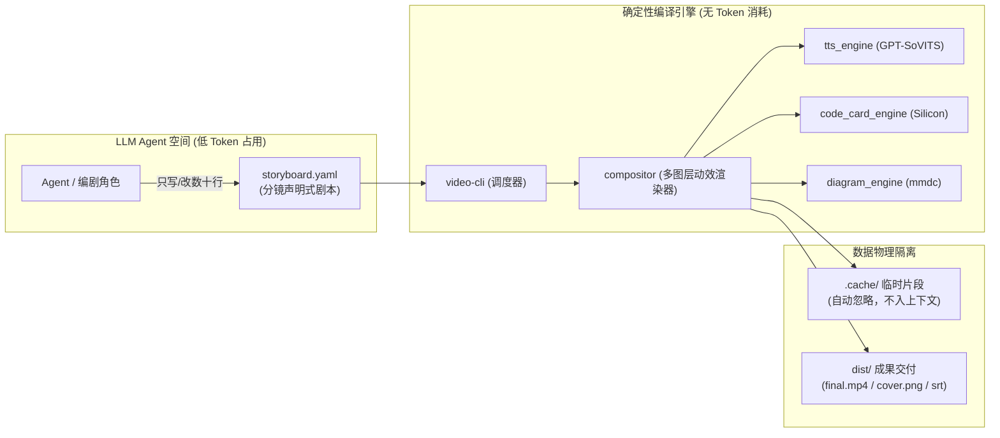
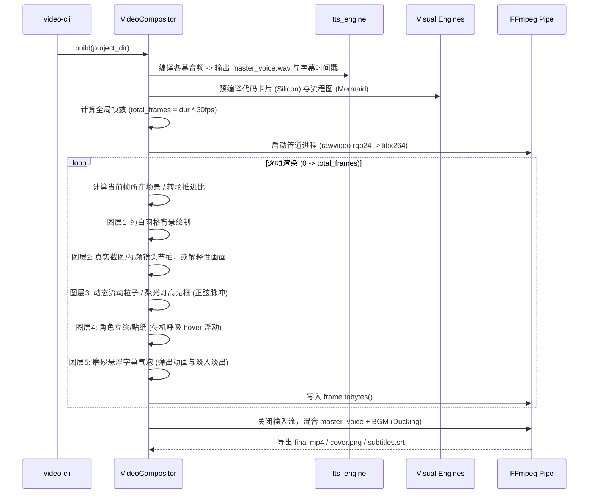

# 🛠️ VideoAgent 核心架构与交接维护手册 (Handover & Maintenance Guide)

> **致未来的 Agent 与维护者**：  
> 本文档是本项目最高优先级的架构全貌与维护指南。当你接手本项目进行 Bug 排查（“跑崩了”）或功能迭代（“加新特性”）时，请先通读本文档，它将帮助你在 3 分钟内理解全貌并做出正确的工程决策。

---

## 📑 目录
1. [系统全景与设计哲学](#1-系统全景与设计哲学)
2. [目录物理结构与职责边界](#2-目录物理结构与职责边界)
3. [核心引擎工作原理与代码流转](#3-核心引擎工作原理与代码流转)
4. [环境依赖与故障排查速查表（跑崩了怎么办）](#4-环境依赖与故障排查速查表跑崩了怎么办)
5. [功能扩展开发指南（如何优雅加功能）](#5-功能扩展开发指南如何优雅加功能)
6. [单步调试与健康检查清单](#6-单步调试与健康检查清单)
7. [素材优先导演模式](#7-素材优先导演模式当前版本交接重点)
8. [质量门禁与回归评估](#8-质量门禁与回归评估)

---

## 1. 系统全景与设计哲学

本项目为 macOS Apple Silicon 架构量身定制，是一套**完全由代码与数据驱动的无面科技视频生产管线**。

### 核心哲学：四层解耦与上下文工程
在传统 Agent 架构中，LLM 直接写代码调用渲染工具，会导致大量临时文件（分段音频、切片 PNG）被吸入 Agent 上下文，造成 Token 爆炸与模型幻觉。  
本项目采用**「确定性编译器 + 声明式剧本」**架构：



- **LLM 只做编剧**：Agent 只关心 `storyboard.yaml` 中的台词、分镜类型与代码内容，不碰任何像素级合成逻辑。
- **渲染零 Token 消耗**：缓动曲线、数据粒子流、角色微动效、混音压制全由本地 Python 进程完成。
- **单集物理隔离**：每个视频都是 `projects/<id>` 下的独立文件夹，项目之间互不干扰。

---

## 2. 目录物理结构与职责边界

```text
~/Desktop/VideoAgent/
├── video-cli                    # [软链接] 指向 engine/cli.py，全局主入口脚手架
│
├── engine/                      # ⚙️ 【核心工具引擎】(无状态纯函数，禁止存放业务数据)
│   ├── auto_director.py         # 🌟 自动导演大脑 (LLM 编剧 + 离线智能知识萃取)
│   ├── content_extractor.py     # 📖 多模态输入提取器 (Markdown / 源码 / Web URL / 主题)
│   ├── story_planner.py         # 🧭 确定性节拍规划器（内容信号 → 叙事节拍 → 分镜）
│   ├── quality_gate.py          # 🔬 剧本质量评分与发布门禁（门槛 75，纯函数）
│   ├── tts_engine.py            # GPT-SoVITS 客户端，带断句、呼吸停顿、分段缓存与情绪调制
│   ├── code_card_engine.py      # Silicon 语法高亮卡片生成器
│   ├── diagram_engine.py        # Mermaid CLI 架构图渲染器
│   ├── media_engine.py          # yt-dlp 精准切片素材下载器
│   ├── compositor.py            # 多图层合成器与 FFmpeg 管道（含真实素材镜头节拍）
│   └── cli.py                   # video-cli 脚手架命令行解析实现 (支持 auto-generate)
│
├── assets/                      # 🌸 【全局只读素材中台】(跨项目通用，读保护)
│   ├── character/               # 绘梨衣立绘与贴纸 (erii_presenter / chibi_think / ...)
│   ├── sfx/                     # 打击感音效 (pop.wav 气泡 / whoosh.wav 滑入 / chime.wav 提示)
│   ├── ref_audio.wav            # 32kHz 零底噪参考音频 (绘梨衣音色基准)
│   └── bgm.mp3                  # Lo-Fi 治愈轻快背景音乐
│
├── projects/                    # 📦 【独立业务工程空间】(每个视频单集一个物理目录)
│   ├── epoll_deepdive/          # 示范工程 A
│   └── redis_reactor/           # 示范工程 B
│       ├── storyboard.yaml      # 🌟 唯一真理源：分镜配置
│       ├── extra_assets/        # 本集专用特异素材 (如外部论文截图)
│       ├── .cache/              # 临时音频与切片缓存 (.gitignore 排除)
│       └── dist/                # 🎯 最终交付成果物
│           ├── final.mp4        # 1080P 全动效高清成片
│           ├── cover.png        # 视频封面图
│           └── subtitles.srt    # 精准时间轴字幕
│
├── scripts/                     # 🔄 向后兼容层 (包装了 engine/ 的历史单脚本入口)
├── tests/                       # 🧪 回归测试 (fixtures/ 固定输入 + snapshots/ 剧本指纹基线)
├── AGENTS.md                    # Agent 行为规范与剧本 YAML 示例
├── README.md                    # 快速开始与使用指南
├── HANDOVER.md                  # 📖 本交接维护手册
└── start_service.sh             # GPT-SoVITS 后台常驻服务一键守护脚本
```

---

## 3. 核心引擎工作原理与代码流转

### 3.1 配音合成与时间线计算 (`engine/tts_engine.py`)
- **断句算法**：正则匹配 `[。！？；\n]+` 保留句末标点，切分为独立语义块。
- **呼吸停顿注入**：在分句之间插入 `pause_sec * sample_rate` 个零 PCM 采样点（默认 `0.45s` 自然气口）。
- **时间戳对齐**：精确返回每句话的 `start_time`、`end_time`、`duration`，供合成器精准驱动逐句字幕与分镜切换。
- **段落 Hash 缓存**：以 `(text, speed, ref_audio)` 的 MD5 为键缓存 `.npy` 数组。改写个别句子时**秒级增量编译**，无需重新跑整个模型。

### 3.2 动效合成器运行管线 (`engine/compositor.py`)


- **内置布局原语库**：
  - `title_card` (封面导览)
  - `split_compare` (左右分屏红绿 PK 对决)
  - `chart_benchmark` (动态跑分生长柱状图 + 数字翻牌器)
  - `terminal` (macOS 极客打字机命令行)
  - `git_diff` (Git 差异对比：红删绿增两栏着色与增量滑入)
  - `custom_nodes` (内核拓扑流向图 + 数据流动粒子)
  - `code` (Silicon 代码卡片 + 呼吸聚光灯)
  - `image` + `presentation: cinematic`（真实截图全屏推镜、平移和聚焦标注）
  - `video_clip`（本地 MP4 抽帧后按同一镜头语言播放）
  - `asset_placeholder`（仅制作期使用，显式标注待补录的真实证据）
- **视听爆点与打击感**：
  - `punch_words` 关键词高能冲击大字报：屏幕居中触觉微震爆出，并同步在底层音轨混入 `punch.wav` 重音音效。
  - `audio.emotion` 情绪声线调制：支持 `excited`（高能欢快）与 `calm`（理性深邃）自动调节语速与模型推理张力。
- **虚拟摄像机**：支持 `zoom_in`（微距推镜）与 `zoom_punch`（冲击回弹），打破幻灯片静态死板感。

---

## 4. 环境依赖与故障排查速查表（跑崩了怎么办）

当视频生成失败或中断时，请依序检查以下核心节点：

### ✅ 前置：依赖自检

Python 依赖已登记在 `requirements.txt`（Pillow / numpy / requests / PyYAML）；渲染还需要 ffmpeg、silicon、mmdc、yt-dlp 四个外部二进制，以及本地 GPT-SoVITS 服务：

```bash
# Python 依赖
python3 -m venv .venv && source .venv/bin/activate && pip install -r requirements.txt

# 外部二进制（macOS）
brew install ffmpeg silicon mermaid-cli yt-dlp

# 一键核对
which ffmpeg ffprobe silicon mmdc yt-dlp && echo "✅ 核心二进制工具就绪"
```

> 注意：`video-cli` / `engine/*.py` 的 shebang 当前指向本地 GPT-SoVITS 虚拟环境解释器。换机器时需要改成本机可用路径，或直接用 `python engine/cli.py ...` 调用。

### 🚨 故障 1：TTS 报错或提示连接被拒绝 (`Connection refused`)
- **现象**：`requests.exceptions.ConnectionError: HTTPConnectionPool(host='127.0.0.1', port=9880)`
- **原因**：本地 GPT-SoVITS 后台推理服务挂掉或未启动。
- **排查与修复**：
  ```bash
  # 1. 检查服务存活
  curl -s http://127.0.0.1:9880/control
  
  # 2. 如果无响应，使用守护脚本重启
  cd /Users/a1-6/Desktop/VideoAgent
  ./start_service.sh
  
  # 3. 如果端口被僵尸进程占用，强杀后重拉
  lsof -i :9880 | awk 'NR>1 {print $2}' | xargs kill -9
  ./start_service.sh
  ```

### 🚨 故障 2：代码卡片生成失败 (`Silicon 渲染失败`)
- **现象**：`RuntimeError: Silicon 渲染失败` 或命令未找到
- **原因**：
  1. 系统未安装或无法执行 `/opt/homebrew/bin/silicon`；
  2. 传入的 `--lang` 不被支持，或者主题不存在。
- **排查与修复**：
  ```bash
  # 测试底层是否正常
  silicon --theme OneHalfLight -l python -o /tmp/test.png -c "print('ok')"
  ```
  如果主题缺失，推荐使用自带的经典浅色主题 `OneHalfLight` 或暗色 `Dracula`。

### 🚨 故障 3：Mermaid 流程图报错 (`mmdc 失败`)
- **现象**：Mermaid 语法报错退出
- **原因**：
  1. Mermaid CLI 未安装；
  2. 剧本中的 Mermaid 代码语法有误（如带有不支持的特殊字符未加双引号）。
- **排查与修复**：
  ```bash
  which mmdc
  # 确保能正常编译最小用例
  echo "graph LR; A-->B" | mmdc -i - -o /tmp/diag.png -b transparent
  ```

### 🚨 故障 4：中文字体缺失或乱码
- **原因**：`compositor.py` 依赖 macOS 原生中文字体 `/System/Library/Fonts/STHeiti Medium.ttc` 和 `Light.ttc`。
- **排查**：
  如果迁移至 Linux 或 Docker 环境，请修改 `engine/compositor.py` 顶部的字体路径为 `Noto Sans CJK SC` 或 `WenQuanYi Micro Hei`。

### 🚨 故障 5：中间缓存损坏或编译不一致
- **原因**：曾修改过音频但旧的 `.npy` 缓存依然存在。
- **修复**：
  ```bash
  ./video-cli clean <project_id>
  ./video-cli build <project_id> --clean
  ```

---

## 5. 功能扩展开发指南（如何优雅加功能）

### 需求场景 1：使用真实录屏或截图替换模板卡片
1. 把素材放入 `projects/<id>/extra_assets/`；录屏推荐 8–15 秒 MP4，截图使用 PNG。
2. 在剧本中优先使用 `image + presentation: cinematic` 或 `video_clip`，并声明 2–4 个 `beats`；见 `AGENTS.md` 的 Cinematic Beats 示例。
3. `video_clip` 会在 `prepare_visual_assets()` 中按 `clip_fps`（默认 12）抽帧至 `.cache/visual/<scene>_clip/`，不要将抽帧图提交或移到根目录。
4. 尚未拿到素材时，使用 `asset_placeholder` 与顶层 `asset_requests` 标记缺口；发布前必须将其替换，不能以模拟终端/跑分充数。

### 需求场景 2：支持新的虚拟形象角色（如新增角色 `sakura`）
1. 在 `assets/character/` 下新建 `sakura/` 目录；
2. 放入该角色的高保真立绘 `sakura_presenter.png`、头像 `sakura_avatar.png` 和贴纸 `sakura_chibi_*.png`；
3. 放入标准 3 秒参考音频 `ref_audio.wav`；
4. 在 `storyboard.yaml` 的 `meta.speaker` 填写 `sakura`，`engine/tts_engine.py` 与 `AssetResolver` 会自动基于名称前缀完成寻址。

### 需求场景 3：适配竖屏短视频 (9:16 抖音/TikTok)
1. 在 `storyboard.yaml` 中配置：
   ```yaml
   meta:
     resolution: [1080, 1920]
   ```
2. 在 `engine/compositor.py` 中，所有卡片与立绘的位置坐标计算均支持根据 `self.width` 和 `self.height` 自适应居中，微调卡片高度与上下留白即可。

---

## 6. 单步调试与健康检查清单

在交接或接手项目后，建议执行一次全面的**自动化健康检查**：

```bash
cd /Users/a1-6/Desktop/VideoAgent

# 1. 验证 Python 解释器与关键库
/Users/a1-6/GPT-SoVITS/venv/bin/python -c "import yaml, PIL, numpy, requests; print('✅ 核心依赖库就绪')"

# 2. 验证外部 CLI 工具链
which ffmpeg ffprobe silicon mmdc yt-dlp && echo "✅ 核心二进制工具就绪"

# 3. 验证本地 TTS 推理引擎
curl -s http://127.0.0.1:9880/control | grep -q "message" && echo "✅ GPT-SoVITS 服务正常运行"

# 4. 查看当前所有项目状态
./video-cli list

# 5. 快速端到端健康构建验证
./video-cli status epoll_deepdive
```

只要以上 5 项测试全部输出 `✅`，即表明整个 VideoAgent 视频生产工作坊处于完全健康的高可用就绪状态！

---

## 7. 素材优先导演模式（当前版本交接重点）

### 设计目标

当前版本不再把自动生成等同于“固定六种卡片的排列”。`AutoDirector` 应先组织可验证的叙事线索，再要求真实截图、录屏或实拍作为证据；解释性图解只用于帮助理解。无来源的数据、终端日志、性能结论和代码 Diff 都不得进入发布版。

### 剧本契约

- 顶层 `asset_requests`：记录尚缺的素材，字段为 `id`、`kind`、`purpose`、`suggested_file`、`capture_notes`。
- `visual.type: image` 搭配 `presentation: cinematic`：真实截图全屏展示；`beats` 中的 `at` 为场景进度，`focus` 和 `callout` 均为素材归一化坐标。
- `visual.type: video_clip`：从 `extra_assets/` 读取 MP4，抽帧缓存到 `.cache/`；优先用于录屏、Demo 和实拍。
- `visual.type: asset_placeholder`：仅用于制作中标注缺口，最终发布前必须替换为 `image` 或 `video_clip`。

### 导演与校验规则

1. `engine/story_planner.py` 的当前流程是“内容信号 → 叙事计划 → storyboard”；`engine/auto_director.py` 只保留 LLM 调度、YAML 清洗与兼容入口。`auto` 会在 `tutorial`、`concept`、`code_walkthrough`、`decision` 中选择；可用 `--story-profile <name>` 覆盖，结果写入 `meta.story_profile`。
2. `meta.content_evidence` 记录从输入材料提炼的事实、数值证据和来源类型。没有至少两项明确数值时不得生成图表；自动导演不生成虚构终端日志和 Diff。
3. LLM 生成内容会经 `sanitize_yaml()` 检查：每幕必须包含 `id`、`audio.text`、`visual.type`；图表必须有 `visual.evidence`；视频/截图 beat 的坐标格式会被校验；新导演剧本不允许连续复用相同原语。
4. 先运行 `./video-cli auto-generate <id> --topic "..." --no-build` 审阅 `story_profile`、`asset_requests` 和占位场景，再补录素材、替换文件名，最后才执行 build。

### 内容节拍规划器

- `extract_story_beats()` 是当前离线导演的第一阶段：它从材料中的标题、层级、事实、源码、数值和现有素材提取 Hook、机制、操作、源码、对比、数据、证据和收束节拍。
- 每个节拍均有 `intent`、`evidence_level`、`source_refs`、`preferred_visuals` 与 `requires_asset`。仅关键操作、运行结果和性能结论可以请求真实素材；没有明确数值时不生成图表。
- `--story-variant mechanism_first|evidence_first` 仅改变节拍次序，不能改变事实、证据或结论。预检会要求 `meta.story_beats` 与 scenes 一一对应，并拒绝无 evidence 的图表、终端或 Diff。
- 素材按 tag/文件名匹配：`operation`、`code`、`architecture`、`metrics`。没有匹配素材时必须保留 `asset_placeholder`，发布构建会拒绝该剧本。

### 指标提取纪律（`extract_metrics`）

只有无歧义单位才能独立证明「这是可复核的量化指标」：

- **强单位**（可直接采信）：`QPS`、`TPS`、`RPS`、`ms`、`MB`、`GB`、`KB`、`%`。
- **歧义单位**（必须邻近性能语境）：`x`、`倍`。语境词见 `METRIC_CONTEXT_WORDS`（压测、基准、吞吐、延迟、提升、降低等），窗口为命中位置前后 24 字符。
- `1920x1080` 这类分辨率会先被 `RESOLUTION_PATTERN` 剥离。
- 生成图表还需同时满足：指标数 ≥ 2，且其中至少一个是强单位。

> 历史故障：`1.0x -> 1.08x` 这样的**镜头变焦倍率**曾被当作性能指标，渲染出标题为「材料提供的数据」的对比柱状图。这正是本项目要避免的"用无关数字伪装证据"。`tests/test_story_planner.py::test_zoom_and_resolution_are_not_treated_as_metrics` 是该问题的回归用例。

### 运镜分配

规划器按节拍意图分配 `camera.motion`，避免全片静止：`hook` 用 `zoom_punch`（开场冲击），`source` / `mechanism` / `workflow` / `metrics` / `comparison` 用 `zoom_in`（讲解推进）；真实素材镜头与收束镜头不加 `camera`，前者由 `beats` 自行运动，后者保持安静。质量门禁会检查镜头运动是否缺失或高度单一。

### 验收路径

```bash
# 1. 只生成剧本，确认没有虚构性能/终端证据
./video-cli auto-generate material_first_demo --topic "你的主题" --no-build

# 2. 补录素材后，在 storyboard.yaml 中改为 image/video_clip + beats
# 3. 发布前预检（占位场景会被拒绝）
./video-cli validate material_first_demo

# 4. 启动 TTS 后渲染
./start_service.sh
./video-cli build material_first_demo
```

### 当前已知限制

- `video_clip` 的默认抽帧率为 12 fps，适合缓慢录屏和操作讲解；高速运动实拍需提高 `clip_fps` 或后续改为原生视频解码管线。
- `asset_placeholder`、缺失媒体和非法镜头节拍会被 `./video-cli validate` 与普通 `build` 拒绝；仅在制作期预览时使用 `--allow-placeholders`。
- 当前机器的 GPT-SoVITS 服务可能未启动。若 `curl http://127.0.0.1:9880/control` 无响应，先启动服务再进行完整成片验收。
- 当输入材料同时缺少操作素材、源码与可复核数值时，`tutorial` 与 `concept` 的镜头形状可能重叠（都属于“解释 + 证据位”）。质量门禁会因缺少 `story_beats` 或镜头重复扣分，但不会仅凭 profile 名称制造差异。

---

## 8. 质量门禁与回归评估

### 评分模型

`engine/quality_gate.py` 是纯函数模块，输入 storyboard（dict），输出可序列化报告，不读文件、不调用 LLM：

| 分项 | 满分 | 评估内容 |
| :--- | ---: | :--- |
| `visual_diversity` | 20 | 镜头原语种类占比，以及相邻场景是否重复同一原语 |
| `rhythm_variety` | 15 | 主导转场占比（6）、角色出镜比例（5）、镜头运动设计（4） |
| `evidence_integrity` | 25 | 图表/终端/Diff 是否有 `evidence`、占位场景数量、真实素材占比 |
| `beat_coverage` | 20 | `meta.story_beats` 是否存在、是否与 scenes 一一对应、意图是否多样 |
| `narration_quality` | 20 | 台词重复、超长句、过短台词、相同开场句式 |

总分 100，默认门槛 75。镜头运动分项：无任何 `camera` 配置得 2/4，≥3 处运动但全为同一种得 1/4，混合运动得 4/4——早期版本在完全没有运镜时也给满分，已修正。

### 阻断规则

- `blocking_issues`：证据型镜头缺少 `evidence`、`story_beats` 与 scenes 不匹配、缺少 `story_beats`、场景少于 3 幕。
- 只要 `blocking_issues` 非空或总分低于门槛，`validate` 返回失败、`build` 抛错且不进入 TTS/渲染。
- 仅当 `meta.story_profile` 属于四种有效 profile 时才强制门槛（`report["enforced"] == True`）；历史工程只打印参考评分，不阻断渲染。
- 内部预览可用 `--allow-low-quality` 绕过评分（但仍不能绕过素材占位检查）。

### 报告落盘

`auto-generate` 会把评分快照写入 `meta.quality_report`，字段为 `score`、`threshold`、`enforced`、`passed`、`breakdown`、`blocking_issues`、`warnings`、`suggestions`。`validate` 与 `build` 会重新计算，确保剧本被手工修改后仍按最新内容评估。

### 回归测试

### 画面体检（`video-cli inspect`）

内容层的质量门禁看不到画面，因此单独提供 `engine/visual_qa.py`：纯函数、只依据 storyboard 与渲染器的布局常量判断，不引入图像模型。

- 阈值来源：`_render_cinematic_asset` 把 `label` 画在 `(42, height-91)`、字号 30；`render_subtitle_pill` 字号 28、左右各 32 内边距、超过 24 字折行、默认水平居中。两者共享同一条底部横带，因此标签宽度与字幕胶囊宽度会直接竞争。
- **字幕逐句显示**，所以估算必须用 `tts_engine.split_sentences()` 逐句取最宽胶囊，不能用整幕台词——早期用整幕台词估算会误报「字幕超出画面」。
- 渲染器侧已有兜底：`_fit_cinematic_label()` 会把超长标签截断并加省略号，保证任何剧本都不会出现遮挡；体检仍会报错，因为被截断意味着文案需要改短。预算按幕缓存，不影响渲染速度。
- `sample_scene_frames()` 按字数估算时长与逐句字幕并补画字幕（成片字幕是在 `build()` 的时间轴循环里叠加的），因此检查帧与成片一致。产物写入 `dist/inspect/qa/`，该目录已在 `.gitignore` 中排除；`dist/inspect/` 根目录只存放 README 引用的人工策展展示图，**不要**把抽帧直接写进根目录（曾因此误删过展示图）。
- 历史工程（无 `story_profile`）只提示不阻断；新导演剧本的画面问题会并入质量报告的 `blocking_issues`。

```bash
# 全部用例（标准库 unittest，无需额外依赖）
PYTHONPYCACHEPREFIX=/tmp/videoagent-pycache python -m unittest discover -s tests -t .

# 修改生成逻辑并确认新输出正确后，重建快照基线
python -m tests.update_snapshots
```

- `tests/fixtures/`：七组固定输入（教程、原理、源码走读、选型、含数值原理、含录屏教程、含歧义数字的对照样本）。
- `tests/snapshots/`：剧本指纹基线，只记录 profile、variant、节拍、场景 id、镜头序列、素材请求与 evidence 标记，不含二进制品。
- `tests/test_story_planner.py`：叙事结构差异、快照稳定、证据纪律、素材标签匹配。
- `tests/test_quality_gate.py`：评分维度、阻断项、占位扣分、历史工程不强制。
- `tests/test_release_gate.py`：占位与低质量阻断、`--allow-placeholders` 预览放行、`codex_tutorial` 兼容。
