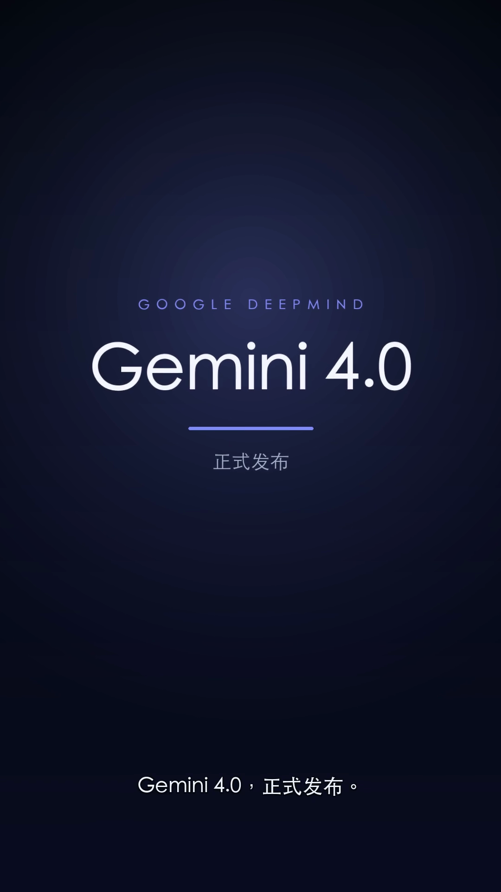
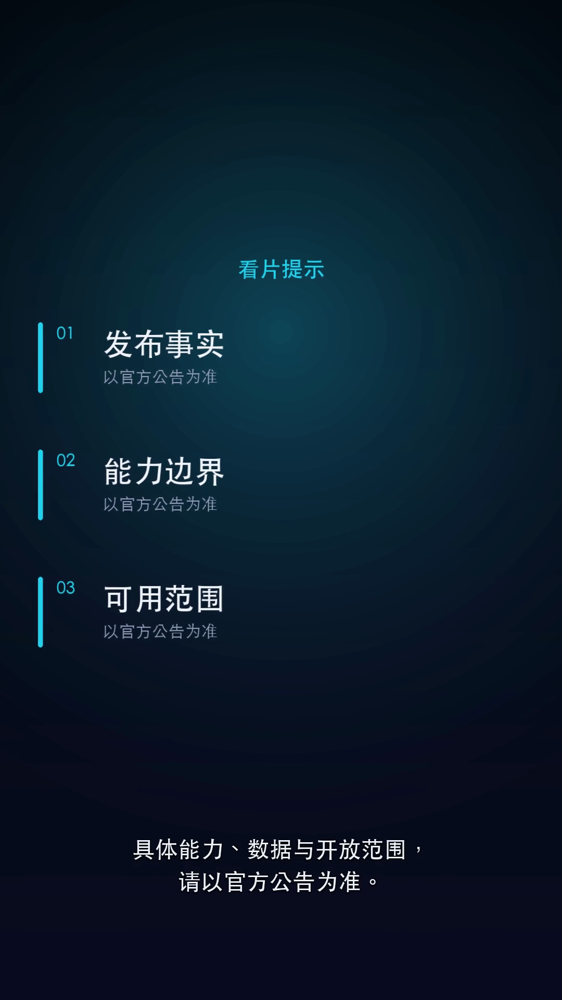
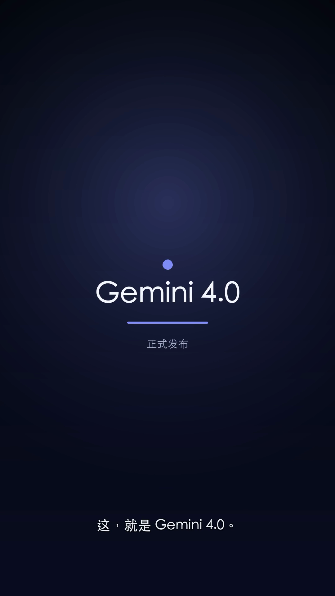
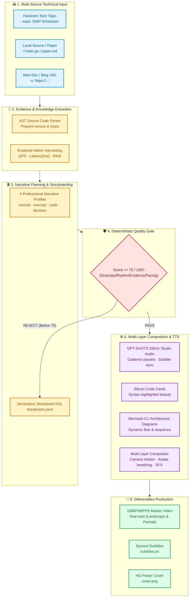

<div align="center">


# 🎬 VideoAgent

### AI-Native Tech Video Production Studio for Apple Silicon & Developers
**Automated 1080P Technical Video Generation Pipeline Powered by LLMs & Apple Silicon**

<p align="center">
  <a href="https://github.com/ciyuan1234/VideoAgent"></a>
  <a href="https://github.com/ciyuan1234/VideoAgent/network/members"></a>
  
  <a href="https://github.com/ciyuan1234/VideoAgent/blob/main/LICENSE"></a>
  <a href="https://www.python.org/downloads/"></a>
  
  <a href="https://github.com/ciyuan1234/VideoAgent/pulls"></a>
</p>

<p align="center">
  <b>Turn any technical topic, Markdown doc, source code, or tech blog URL into a cinematic 1080P tech video in minutes.</b>
</p>

<p align="center">
  <a href="#-showcase">Showcase</a> •
  <a href="#-why-videoagent">Why VideoAgent</a> •
  <a href="#-architecture">Architecture</a> •
  <a href="#-quick-start">Quick Start</a> •
  <a href="#-declarative-storyboard-storyboardyaml">Storyboard DSL</a> •
  <a href="#-quality-gate">Quality Gate</a> •
  <a href="#-cli-cheatsheet">CLI Cheatsheet</a> •
  <a href="README.md">简体中文</a>
</p>

</div>

---

## 📺 Showcase

Designed specifically for **systems programming, cloud-native architecture, kernel internals, and algorithmic deep-dives**:

### 🎨 Dual-Format Visual Showcases (Horizontal & Vertical)

#### 1. 🖥️ 16:9 Minimalist Tech Grid (Optimized for YouTube / Bilibili Deep-Dives)

<p align="center">
  
  
</p>
<p align="center">
  
  
</p>

<p align="center">
  
  
  
</p>

> **✨ Landscape Highlights**: Crisp technical grid backdrop • Dynamic Silicon syntax-highlighted code cards • Interactive Mermaid architecture/flowcharts • Anime avatar micro-breathing motion • Word-level synced subtitles • Tactile sound effects (SFX) & relaxing Lo-Fi background music.

#### 2. 📱 9:16 Cinematic Launch Teaser `launch_teaser` (Optimized for TikTok / Shorts / Reels)

<p align="center">
  
  
  
  
</p>

> **✨ Portrait Highlights**: 1080×1920 Deep-space dark gradient • Radial center glow • Bold opinion statements with live highlight • Thin-line numbered feature stack • Broadcast-grade 15-frame cross-dissolve transitions.

---

## 💡 Ecosystem Comparison

Why do developers need **VideoAgent** when tools like MoneyPrinterTurbo, VideoLingo, and Manim already exist?

| Dimension | 🎬 **VideoAgent (This Project)** | 💸 **MoneyPrinterTurbo** | 🌐 **VideoLingo** | 📐 **Manim** |
| :--- | :--- | :--- | :--- | :--- |
| **Primary Focus** | **Hardcore Tech, Code, & Systems Video Production** | Generic viral short videos / Faceless reels | Localizing existing videos (Dubbing & Translation) | Mathematical formula animation & geometry |
| **Visual Canvas** | **Silicon Code Cards + Mermaid Diagrams + Tech Grids** | Stock footage (Pexels / Pixabay nature/cityscapes) | Cropped source video + overlaid subtitle boxes | Vector transformations + LaTeX formula morphing |
| **Evidence & Facts** | **AST Code Parsing + Metrics (QPS, ms latency, RAM)** | Creative writing, no fact verification | Restricted to source video transcript | Pure mathematical proofs, no doc extractor |
| **Creation Paradigm**| **Declarative Storyboard YAML + 1-Click Auto Director** | WebUI topic prompt input | WebUI upload video / YouTube URL | Write Python code calculating exact coordinates |
| **Voiceover & Audio**| **32kHz Studio Voice + Cadence Pauses + Micro SFX** | Standard Edge-TTS / generic speech | WhisperX segmentation + CosyVoice cloning | No native voiceover pipeline (must merge outside) |
| **Quality Control**  | **5-Dimensional Quality Gate (Intercepts below 75 pts)** | None; output quality depends on LLM roll | Manual proofreading in UI | Manual visual tweaking |
| **Aspect Ratios**    | **16:9 Landscape Deep-Dives + 9:16 Portrait Launch Teasers**| Mainly 9:16 vertical short videos | Preserves original video ratio | Default 16:9 horizontal |
| **Hardware & Cost**  | **Apple Silicon MPS/Metal Acceleration, 100% Free & Local**| Third-party commercial API credits | Local GPU or cloud API | Local Python + FFmpeg |

---

## 🌟 Key Features

### 1. 🤖 Zero-Click Auto-Director
Feed in any technical topic, local Markdown / source code, or online blog URL. The built-in `content_extractor.py` handles:
- **Structured Code Extraction**: Pull code blocks, heading hierarchy, and key bullet points.
- **Empirical Metric Harvesting**: Extract real QPS, TPS, latency (ms), throughput, and memory measurements.
- **Automated Workflow**: Knowledge extraction ➔ Narrative beat planning ➔ Storyboard compilation ➔ Quality check ➔ High-res rendering.

### 2. 🎭 4 Built-In Technical Narrative Profiles
- **`tutorial`**: Practical walkthrough (Pain point ➔ Environment setup ➔ Core command ➔ Key code ➔ Troubleshooting ➔ Verification).
- **`concept`**: Mechanism deep-dive (Motivation ➔ Architecture ➔ Core primitives ➔ Runtime lifecycle ➔ High-level recap).
- **`code_walkthrough`**: Source code reading (Data structures ➔ Driver loop ➔ Branch logic ➔ Big-O complexity & corner cases).
- **`decision`**: Tech selection & trade-offs (Scenario ➔ Benchmarks ➔ Comparison matrix ➔ Trade-off analysis ➔ Recommendation).

> 💡 **Variants**: Supports `--story-variant evidence_first` (puts real metrics first) and `mechanism_first` (explains architecture first).

### 3. 🛡️ 5-Dimensional Deterministic Quality Gate
Scores your storyboard from 0 to 100 before rendering. Intercepts any script below 75 points:
- **Visual Diversity (20 pts)**: Penalizes back-to-back duplicate layouts.
- **Rhythm Variety (15 pts)**: Ensures alternating cadences and dynamic pacing.
- **Evidence Integrity (25 pts)**: Rejects hand-wavy claims without code, benchmarks, or charts.
- **Beat Coverage (20 pts)**: Ensures complete narrative arcs.
- **Narration Quality (20 pts)**: Enforces optimal sentence length for broadcast readability.

---

## 📂 Architecture

### 🔄 End-to-End Pipeline



### 🏛️ Four-Layer Decoupled Layout

Decoupled into 4 clean layers for seamless human & AI agent collaboration:

```text
VideoAgent/
├── video-cli                    # 🚀 Unified scaffolding CLI (init/build/validate/auto-generate)
│
├── engine/                      # ⚙️ [Core Engines] (Stateless pure functions)
│   ├── auto_director.py         # End-to-end auto director
│   ├── story_planner.py         # Deterministic narrative beat planner (4 profiles)
│   ├── quality_gate.py          # 5-Dimensional quality evaluation gate (threshold 75)
│   ├── content_extractor.py     # Heading, code snippet, and bullet extractor
│   ├── tts_engine.py            # GPT-SoVITS speech synthesis with timestamp alignment
│   ├── code_card_engine.py      # Silicon code card renderer
│   ├── diagram_engine.py        # Mermaid CLI diagram generator
│   ├── media_engine.py          # Video slice & clip downloader
│   └── compositor.py            # Multi-layer dynamic rendering engine
│
├── assets/                      # 🌸 [Global Shared Assets] (Read-only templates)
│   ├── character/               # Presenter avatar & anime sticker pack
│   ├── sfx/                     # Micro sound effects (pop, whoosh, chime, punch)
│   ├── ref_audio.wav            # 32kHz studio reference audio
│   └── bgm.mp3                  # Lo-Fi background music
│
├── projects/                    # 📦 [Independent Project Spaces] (Physical isolation)
│   └── epoll_deepdive/          # Project sandbox
│       ├── storyboard.yaml      # 🌟 Declarative storyboard specification
│       ├── extra_assets/        # Project-specific assets
│       ├── .cache/              # Intermediate caches (auto-excluded)
│       └── dist/                # 🎯 Deliverables (final.mp4, cover.png, subtitles.srt)
│
├── AGENTS.md                    # 🤖 LLM Agent prompt orchestration manual
└── HANDOVER.md                  # 📖 Engineering maintenance & troubleshooting guide
```

---

## 🚀 Quick Start

### 1. Prerequisites

```bash
# Python 3.10+ recommended
git clone https://github.com/ciyuan1234/VideoAgent.git
cd VideoAgent

# Install dependencies
pip install pyyaml requests

# Install FFmpeg and Node for Mermaid diagrams
brew install ffmpeg node
npm install -g @mermaid-js/mermaid-cli
```

### 2. Launch Local Voice Engine (Optional)
```bash
./start_service.sh
```

### 3. One-Click Generation

```bash
# Option A: Auto-generate from a technical topic
./video-cli auto-generate goroutine_gmp --topic "Go Goroutine Scheduler and GMP Model"

# Option B: Auto-generate from a local Markdown file or source code
./video-cli auto-generate my_paper -f ~/Desktop/paper.md

# Option C: Auto-generate from an online blog/doc URL
./video-cli auto-generate redis_guide -u "https://redis.io/docs/latest/operate/oss_and_stack/management/optimization/latency-monitor/"
```

Your 1080P video, cover image, and subtitles are ready in `projects/<project_name>/dist/`!

---

## 📝 Declarative Storyboard (`storyboard.yaml`)

Forget writing complex FFmpeg commands or tedious video timeline editing. You (or an AI Agent) simply declare your scene logic in YAML:

<table>
  <tr>
    <th width="50%">📝 Declarative Spec (storyboard.yaml)</th>
    <th width="50%">🎬 Compiled Rendered Deliverable</th>
  </tr>
  <tr>
    <td>

```yaml
meta:
  title: "Understanding Redis Event Loop"
  speaker: "erii"
  theme: "white_grid"
  story_profile: "concept"
  story_variant: "evidence_first"

scenes:
  - id: "code_analysis"
    character_sticker: "erii_chibi_think"
    audio:
      text: "Let's inspect the core event loop handler aeProcessEvents."
      speed: 1.0
      pause: 0.3
    visual:
      type: "code_card"
      lang: "c"
      theme: "OneHalfLight"
      title: "ae.c - Main Event Loop"
      code: |
        int aeProcessEvents(aeEventLoop *eventLoop, int flags) {
            int processed = 0, numevents;
            numevents = aeApiPoll(eventLoop, tvp);
            // ...
        }
```

</td>
    <td align="center">
      
    </td>
  </tr>
</table>

---

## 🧭 CLI Cheatsheet

| Command | Description | Example |
| :--- | :--- | :--- |
| `auto-generate` | **End-to-end video creation** | `./video-cli auto-generate epoll --topic "Linux epoll" --model gemini-1.5-flash` |
| `init` | Scaffold a new project space | `./video-cli init my_topic --title "Understanding Redis"` |
| `validate` | Run quality gate & check assets | `./video-cli validate my_topic` |
| `build` | Render 1080P deliverables | `./video-cli build my_topic` |
| `list` | List all local projects | `./video-cli list` |
| `status` | View metadata and render info | `./video-cli status my_topic` |
| `clean` | Safely remove build caches | `./video-cli clean my_topic` |

---

## ❓ Frequently Asked Questions (FAQ)

<details>
<summary><b>Q1: Do I need to purchase expensive cloud APIs to run VideoAgent?</b></summary>
<br/>
<b>Not at all!</b> VideoAgent is designed local-first:
<ul>
  <li><b>Knowledge Extraction & Scripting</b>: Works with local Ollama models (e.g., Llama 3, DeepSeek, Qwen), standard OpenAI-compatible APIs, or free-tier Gemini API;</li>
  <li><b>Voiceover Synthesis</b>: Bundles dedicated GPT-SoVITS inference (run <code>./start_service.sh</code>) to produce studio-grade 32kHz speech locally;</li>
  <li><b>Rendering & Composition</b>: Purely executed on your local machine with hardware acceleration (Apple Silicon Metal / MPS), zero cloud rendering fees, and 100% private code protection.</li>
</ul>
</details>

<details>
<summary><b>Q2: How is VideoAgent different from generic "AI short video generators"?</b></summary>
<br/>
Most AI video generation tools are tailored for generic, viral social media clips, stitching unrelated stock nature or cityscape videos from stock platforms. <b>They fundamentally fail at technical or computer science topics.</b><br/><br/>
VideoAgent is specifically engineered for developers:
<ul>
  <li><b>Code-Level Fidelity</b>: Parses real AST abstract syntax trees and renders syntax-highlighted Silicon cards;</li>
  <li><b>Logic Visualization</b>: Automatically compiles technical flows into native Mermaid architecture and sequence diagrams;</li>
  <li><b>Strict Evidence Discipline</b>: Extracts empirical measurements (QPS, TPS, memory, ms latency) as scene anchors, preventing hollow AI hallucinations.</li>
</ul>
</details>

<details>
<summary><b>Q3: What should I do if the Quality Gate rejects a storyboard below 75 points?</b></summary>
<br/>
The Quality Gate guarantees professional production quality. When running <code>validate</code> or <code>build</code>, if a score falls below 75, the terminal prints a granular diagnostic report (e.g., <i>missing runtime code evidence, repetitive consecutive camera layouts, or excessively long sentences lacking pauses</i>).<br/>
Follow the recommendations to tweak <code>storyboard.yaml</code>. If you just want a quick draft preview, simply append <code>--allow-low-quality</code> to bypass the gate.
</details>

<details>
<summary><b>Q4: Can I customize the presenter character and voice?</b></summary>
<br/>
<b>Very simple!</b>
<ul>
  <li><b>Character Avatars</b>: Place your transparent PNGs into <code>assets/character/</code> and declare the filename under <code>character_sticker</code> in the storyboard;</li>
  <li><b>Voice Reference</b>: Save a 5–10s clean audio sample as <code>assets/ref_audio.wav</code>, and GPT-SoVITS will automatically clone your desired timbre.</li>
</ul>
</details>

<details>
<summary><b>Q5: Can the output videos be directly published to video platforms?</b></summary>
<br/>
Yes! Every build packages full deliverables in <code>dist/</code>:
<ul>
  <li><code>final.mp4</code>: Standard H.264 / AAC 1080P video (16:9 landscape or 9:16 portrait);</li>
  <li><code>cover.png</code>: HD video thumbnail cover;</li>
  <li><code>subtitles.srt</code>: Millisecond-accurate standalone subtitles. Ready to drag and drop onto YouTube, Bilibili, TikTok, or Reels.</li>
</ul>
</details>

---

## 🗺️ Roadmap

- [x] **v1.0**: 4-Layer decoupled architecture, Silicon code cards, Mermaid charts, multi-layer compositor.
- [x] **v1.2**: Zero-click auto-director with 4 technical narrative structures.
- [x] **v1.5**: 5-Dimensional deterministic quality gate & snapshot regression test suite.
- [x] **v1.8**: `launch_teaser` portrait launch teaser style & visual QA layout check.
- [ ] **v2.0 (In Progress)**:
  - [ ] Interactive WebUI storyboard editor.
  - [ ] Extended presenter avatar packs (Cyberpunk, Geek, Corporate).
  - [ ] Auto-upload plugins for YouTube, Bilibili, and TikTok/Reels.
  - [ ] Remotion modern frontend rendering backend.

---

## 🤝 Contributing

Contributions are warmly welcome! Whether it's visual primitives, narrative templates, or documentation improvements:
1. Fork the repository and create your branch (`git checkout -b feature/AmazingFeature`)
2. Commit your changes (`git commit -m 'feat: Add some AmazingFeature'`)
3. Push to the branch (`git push origin feature/AmazingFeature`)
4. Open a Pull Request

<div align="center">
  <br/>
  <a href="https://github.com/ciyuan1234/VideoAgent/graphs/contributors">
    
  </a>
</div>

---

## 🌟 Star History

If VideoAgent helps your technical content creation, please consider giving us a **Star ⭐️**!

[](https://star-history.com/#ciyuan1234/VideoAgent&Date)

---

## 📄 License

Distributed under the [MIT License](LICENSE).
