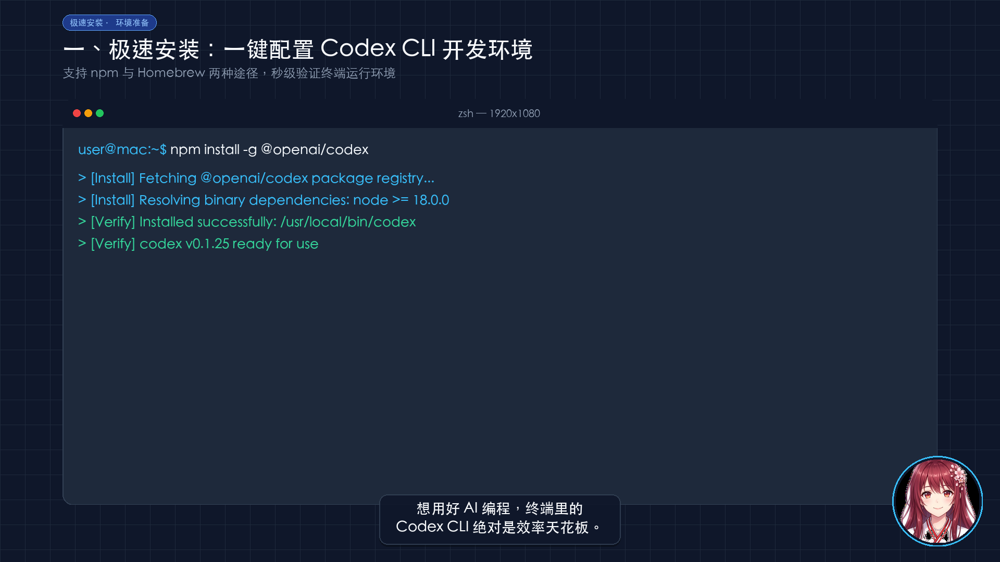
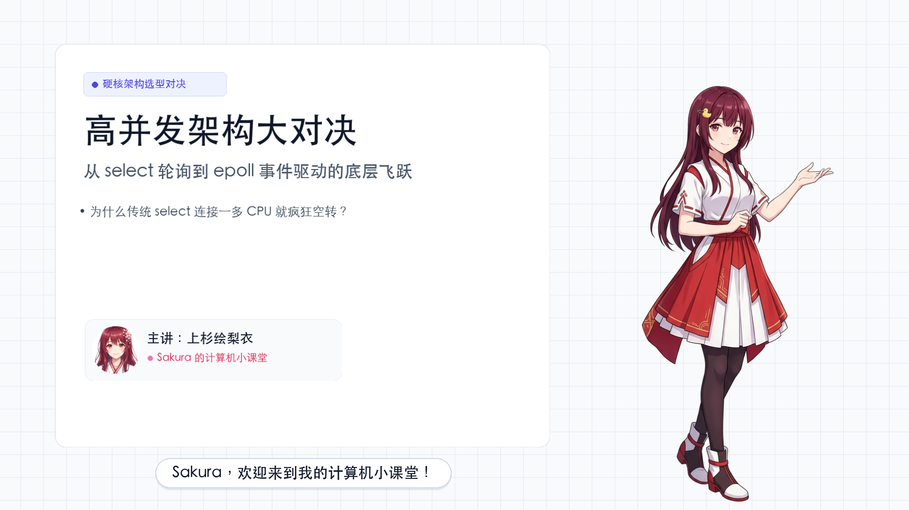
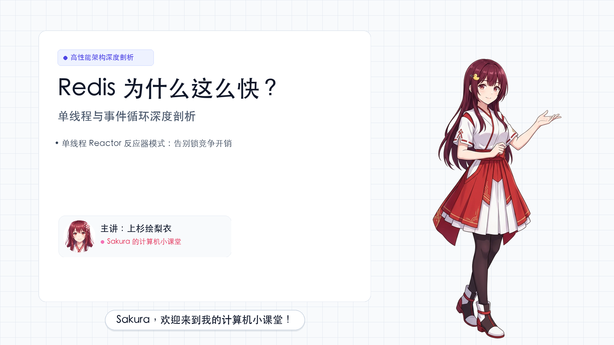
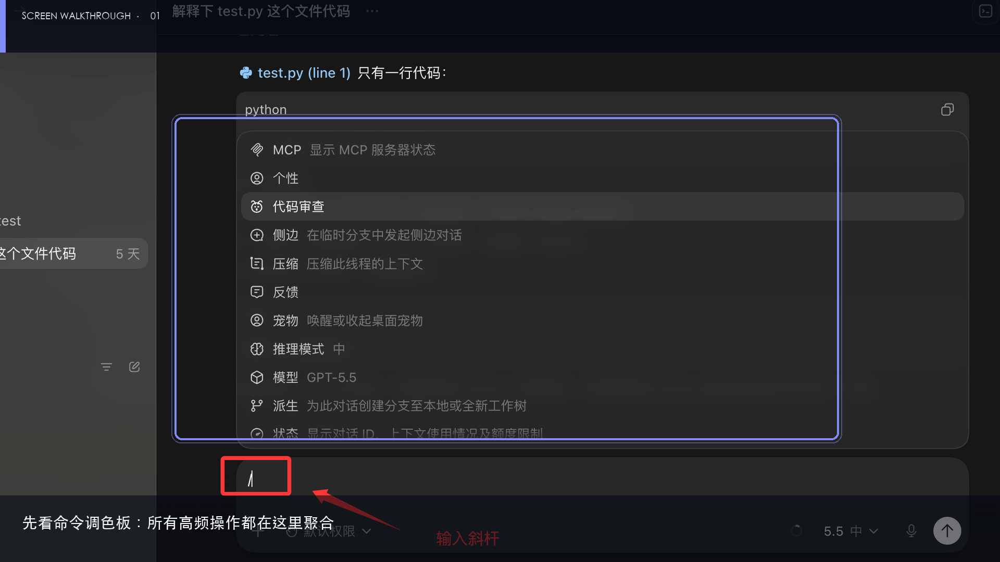
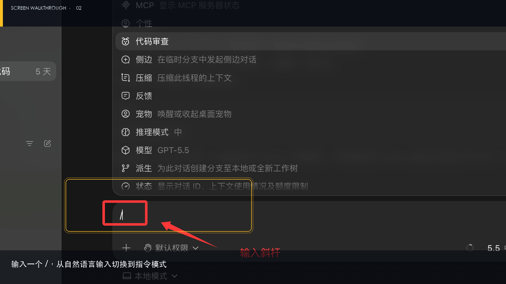
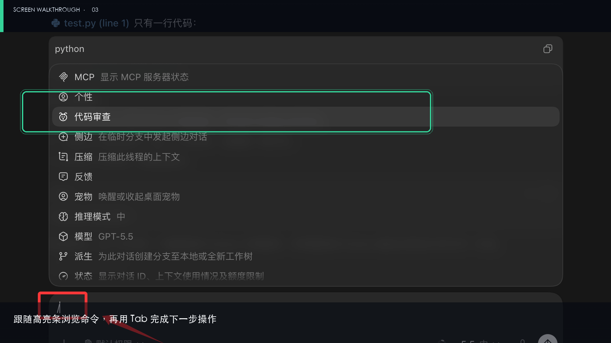

<div align="center">


# 🎬 VideoAgent

### AI-Native Tech Video Production Studio for Apple Silicon & Developers
**Automated 1080P Technical Video Generation Pipeline Powered by LLMs & Apple Silicon**

<p align="center">
  <a href="https://github.com/ciyuan1234/VideoAgent"></a>
  <a href="https://github.com/ciyuan1234/VideoAgent/network/members"></a>
  <a href="https://github.com/ciyuan1234/VideoAgent/blob/main/LICENSE"></a>
  <a href="https://www.python.org/downloads/"></a>
  
  <a href="https://github.com/ciyuan1234/VideoAgent/pulls"></a>
</p>

<p align="center">
  <b>Turn any technical topic, Markdown doc, source code, or tech blog URL into a cinematic 1080P tech video in minutes.</b>
</p>

<p align="center">
  <a href="#-showcase">Showcase</a> •
  <a href="#-why-videoagent">Why VideoAgent</a> •
  <a href="#-architecture">Architecture</a> •
  <a href="#-quick-start">Quick Start</a> •
  <a href="#-declarative-storyboard-storyboardyaml">Storyboard DSL</a> •
  <a href="#-quality-gate">Quality Gate</a> •
  <a href="#-cli-cheatsheet">CLI Cheatsheet</a> •
  <a href="README.md">简体中文</a>
</p>

</div>

---

## 📺 Showcase

Designed specifically for **systems programming, cloud-native architecture, kernel internals, and algorithmic deep-dives**:

### 🎨 Rendered Covers & Posters (1080P Deliverables)

<p align="center">
  
  
</p>
<p align="center">
  
  
</p>

### 🎬 Cinematic In-Video Frames

<p align="center">
  
  
  
</p>

> **✨ Visual Features**: Minimalist tech grid backdrop • Syntax-highlighted Silicon code cards • Native Mermaid architectural & sequence charts • Anime avatar micro-breathing animations • Subtitle sync aligned to pauses • Tactile SFX and curated Lo-Fi background music.

---

## 💡 Why VideoAgent?

Traditional tech video creation takes grueling effort:

| Aspect | Traditional Manual Editing | Basic "Slide/PPT" Tools | 🎬 **VideoAgent** |
| :--- | :--- | :--- | :--- |
| **Turnaround Time** | 8 - 12 hours / episode | 15 - 30 minutes / episode | ⚡ **3 - 5 minutes zero-click generation** |
| **Code Presentation** | Screen recording, blurry, prone to typos | Monotone static code screenshots | 💎 **Silicon-grade syntax highlighting cards** |
| **Architecture Diagrams** | Draw.io tedious editing | No native diagram rendering | 📊 **Mermaid native architecture / sequence diagrams** |
| **Voiceover & Audio** | Manual multi-takes or robotic voice | Monotonous, lacking natural pauses | 🎙️ **32kHz GPT-SoVITS studio voice + cadence pauses** |
| **Quality Control** | Subjective, inconsistent | Generic clichés, empty fluff | 🛡️ **5-Dimensional Quality Gate (Intercepts below 75)** |
| **Cost & Privacy** | High | Expensive SaaS subscription & privacy risk | 🍎 **Local Apple Silicon MPS acceleration, 0 cloud cost** |

---

## 🌟 Key Features

### 1. 🤖 Zero-Click Auto-Director
Feed in any technical topic, local Markdown / source code, or online blog URL. The built-in `content_extractor.py` handles:
- **Structured Code Extraction**: Pull code blocks, heading hierarchy, and key bullet points.
- **Empirical Metric Harvesting**: Extract real QPS, TPS, latency (ms), throughput, and memory measurements.
- **Automated Workflow**: Knowledge extraction ➔ Narrative beat planning ➔ Storyboard compilation ➔ Quality check ➔ High-res rendering.

### 2. 🎭 4 Built-In Technical Narrative Profiles
- **`tutorial`**: Practical walkthrough (Pain point ➔ Environment setup ➔ Core command ➔ Key code ➔ Troubleshooting ➔ Verification).
- **`concept`**: Mechanism deep-dive (Motivation ➔ Architecture ➔ Core primitives ➔ Runtime lifecycle ➔ High-level recap).
- **`code_walkthrough`**: Source code reading (Data structures ➔ Driver loop ➔ Branch logic ➔ Big-O complexity & corner cases).
- **`decision`**: Tech selection & trade-offs (Scenario ➔ Benchmarks ➔ Comparison matrix ➔ Trade-off analysis ➔ Recommendation).

> 💡 **Variants**: Supports `--story-variant evidence_first` (puts real metrics first) and `mechanism_first` (explains architecture first).

### 3. 🛡️ 5-Dimensional Deterministic Quality Gate
Scores your storyboard from 0 to 100 before rendering. Intercepts any script below 75 points:
- **Visual Diversity (20 pts)**: Penalizes back-to-back duplicate layouts.
- **Rhythm Variety (15 pts)**: Ensures alternating cadences and dynamic pacing.
- **Evidence Integrity (25 pts)**: Rejects hand-wavy claims without code, benchmarks, or charts.
- **Beat Coverage (20 pts)**: Ensures complete narrative arcs.
- **Narration Quality (20 pts)**: Enforces optimal sentence length for broadcast readability.

---

## 📂 Architecture

Decoupled into 4 clean layers for seamless human & AI agent collaboration:

```text
VideoAgent/
├── video-cli                    # 🚀 Unified scaffolding CLI (init/build/validate/auto-generate)
│
├── engine/                      # ⚙️ [Core Engines] (Stateless pure functions)
│   ├── auto_director.py         # End-to-end auto director
│   ├── story_planner.py         # Deterministic narrative beat planner (4 profiles)
│   ├── quality_gate.py          # 5-Dimensional quality evaluation gate (threshold 75)
│   ├── content_extractor.py     # Heading, code snippet, and bullet extractor
│   ├── tts_engine.py            # GPT-SoVITS speech synthesis with timestamp alignment
│   ├── code_card_engine.py      # Silicon code card renderer
│   ├── diagram_engine.py        # Mermaid CLI diagram generator
│   ├── media_engine.py          # Video slice & clip downloader
│   └── compositor.py            # Multi-layer dynamic rendering engine
│
├── assets/                      # 🌸 [Global Shared Assets] (Read-only templates)
│   ├── character/               # Presenter avatar & anime sticker pack
│   ├── sfx/                     # Micro sound effects (pop, whoosh, chime, punch)
│   ├── ref_audio.wav            # 32kHz studio reference audio
│   └── bgm.mp3                  # Lo-Fi background music
│
├── projects/                    # 📦 [Independent Project Spaces] (Physical isolation)
│   └── epoll_deepdive/          # Project sandbox
│       ├── storyboard.yaml      # 🌟 Declarative storyboard specification
│       ├── extra_assets/        # Project-specific assets
│       ├── .cache/              # Intermediate caches (auto-excluded)
│       └── dist/                # 🎯 Deliverables (final.mp4, cover.png, subtitles.srt)
│
├── AGENTS.md                    # 🤖 LLM Agent prompt orchestration manual
└── HANDOVER.md                  # 📖 Engineering maintenance & troubleshooting guide
```

---

## 🚀 Quick Start

### 1. Prerequisites

```bash
# Python 3.10+ recommended
git clone https://github.com/ciyuan1234/VideoAgent.git
cd VideoAgent

# Install dependencies
pip install pyyaml requests

# Install FFmpeg and Node for Mermaid diagrams
brew install ffmpeg node
npm install -g @mermaid-js/mermaid-cli
```

### 2. Launch Local Voice Engine (Optional)
```bash
./start_service.sh
```

### 3. One-Click Generation

```bash
# Option A: Auto-generate from a technical topic
./video-cli auto-generate goroutine_gmp --topic "Go Goroutine Scheduler and GMP Model"

# Option B: Auto-generate from a local Markdown file or source code
./video-cli auto-generate my_paper -f ~/Desktop/paper.md

# Option C: Auto-generate from an online blog/doc URL
./video-cli auto-generate redis_guide -u "https://redis.io/docs/latest/operate/oss_and_stack/management/optimization/latency-monitor/"
```

Your 1080P video, cover image, and subtitles are ready in `projects/<project_name>/dist/`!

---

## 🧭 CLI Cheatsheet

| Command | Description | Example |
| :--- | :--- | :--- |
| `auto-generate` | **End-to-end video creation** | `./video-cli auto-generate epoll --topic "Linux epoll" --model gemini-1.5-flash` |
| `init` | Scaffold a new project space | `./video-cli init my_topic --title "Understanding Redis"` |
| `validate` | Run quality gate & check assets | `./video-cli validate my_topic` |
| `build` | Render 1080P deliverables | `./video-cli build my_topic` |
| `list` | List all local projects | `./video-cli list` |
| `status` | View metadata and render info | `./video-cli status my_topic` |
| `clean` | Safely remove build caches | `./video-cli clean my_topic` |

---

## 🗺️ Roadmap

- [x] **v1.0**: 4-Layer decoupled architecture, Silicon code cards, Mermaid charts, multi-layer compositor.
- [x] **v1.2**: Zero-click auto-director with 4 technical narrative structures.
- [x] **v1.5**: 5-Dimensional deterministic quality gate & snapshot regression test suite.
- [ ] **v2.0 (In Progress)**:
  - [ ] Interactive WebUI storyboard editor.
  - [ ] Extended presenter avatar packs (Cyberpunk, Geek, Corporate).
  - [ ] Auto-upload plugins for YouTube, Bilibili, and TikTok/Reels.
  - [ ] Remotion modern frontend rendering backend.

---

## 🌟 Star History

If VideoAgent helps your technical content creation, please consider giving us a **Star ⭐️**!

[](https://star-history.com/#ciyuan1234/VideoAgent&Date)

---

## 📄 License

Distributed under the [MIT License](LICENSE).
